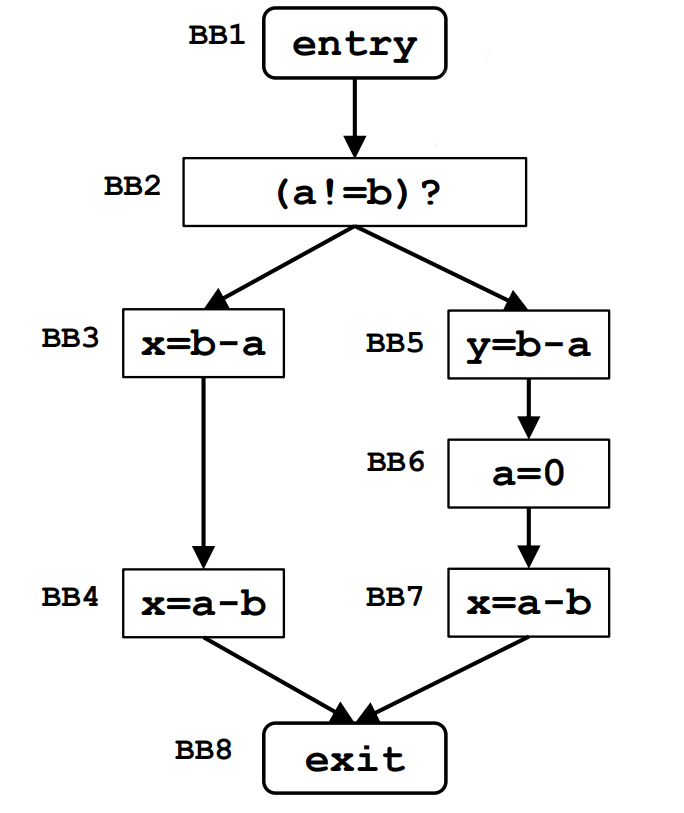
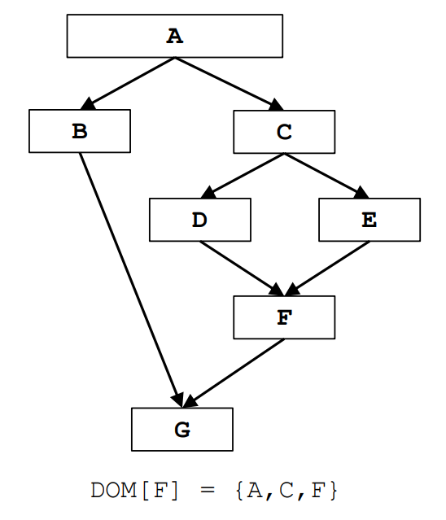
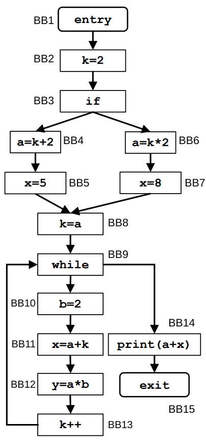

## Very Busy Expression Analysis

### **VBE Framework**

| **Component**                 | VBE                                                                                               |
| ----------------------------- | ------------------------------------------------------------------------------------------------- |
| **Domain**                    | Sets of expressions                                                                               |
| **Direction**                 | Backward: $\text{in}[b]$ = $f_b(\text{out}[b])$ out[b] = $\wedge \text{in}(\text{succ}[b])$ |
| **Transfer Function**         | $f_b(x) = \text{Gen}[b] \cup (\text{in}[b] - \text{Kill}[b])$                                     |
| **Meet Operation** ($\wedge$) | $\cap$                                                                                            |
| **Boundary Condition**        | $\text{in[entry]} = \emptyset$                                                                    |
| **Initial Interior Points**   | $\text{in[b]} = \mathcal{U}$                                                                      |

- **Gen[b]**: The set of expressions **evaluated** within basic block *b*. These are the expressions that are guaranteed to be computed before any possible exit from the block.

- **Kill[b]**: The set of expressions that can no longer be considered "very busy" when exiting *b* because at least one of the variables used in them is **redefined** within the block. In other words, an expression is killed if one of its operands is modified inside *b*.

### **VBE Table**

| **Basic Block** | **In[b]**                  | **Out[b]**            |
| --------------- | -------------------------- | --------------------- |
| **BB1 (entry)** | $\lbrace b-a \rbrace$      | $\lbrace b-a \rbrace$ |
| **BB2**         | $\lbrace b-a \rbrace$      | $\lbrace b-a \rbrace$ |
| **BB3**         | $\lbrace b-a, a-b \rbrace$ | $\lbrace a-b \rbrace$ |
| **BB4**         | $\lbrace a-b \rbrace$      | $\emptyset$           |
| **BB5**         | $\lbrace b-a \rbrace$      | $\emptyset$           |
| **BB6**         | $\emptyset$                | $\lbrace a-b \rbrace$ |
| **BB7**         | $\lbrace a-b \rbrace$      | $\emptyset$           |
| **BB8 (exit)**  | $\emptyset$                | $\emptyset$           |

---

## Dominator Analysis

### **DA Framework**

| **Component**                 | DA                                                                                                        |
| ----------------------------- | --------------------------------------------------------------------------------------------------------- |
| **Domain**                    | Sets of Basic Blocks                                                                                      |
| **Direction**                 | Forward: $\text{out}[b]$ = $f_b(\text{in}[b])$ $\text{in}[b]$ = $\wedge \text{out}(\text{pred}[b])$ |
| **Transfer Function**         | $f_b(x) =  x \cup \lbrace b \rbrace$                                                                      |
| **Meet Operation** ($\wedge$) | $\cap$                                                                                                    |
| **Boundary Condition**        | $\text{out[entry]} = \emptyset$                                                                           |
| **Initial Interior Points**   | $\text{out[b]} = \mathcal{U}$                                                                             |

### **DA Table**

| **Basic Block** | **In[b]**              | **Out[b]**                |
| --------------- | ---------------------- | ------------------------- |
| **A (entry)**   | $\emptyset$            | $\lbrace A \rbrace$       |
| **B**           | $\lbrace A \rbrace$    | $\lbrace A, B \rbrace$    |
| **C**           | $\lbrace A \rbrace$    | $\lbrace A, C \rbrace$    |
| **D**           | $\lbrace A, C \rbrace$ | $\lbrace A, C, D \rbrace$ |
| **E**           | $\lbrace A, C \rbrace$ | $\lbrace A, C, E \rbrace$ |
| **F**           | $\lbrace A, C \rbrace$ | $\lbrace A, C, F \rbrace$ |
| **G (exit)**    | $\lbrace A \rbrace$    | $\lbrace A, G \rbrace$    |

---

## Constant Propagation

### **CP Framework**

| **Component**                 | CP                                                                                                        |
| ----------------------------- | --------------------------------------------------------------------------------------------------------- |
| **Domain**                    | Sets of pairs $(var, val)$                                                                                |
| **Direction**                 | Forward: $\text{out}[b]$ = $f_b(\text{in}[b])$ $\text{in}[b]$ = $\wedge \text{out}(\text{pred}[b])$ |
| **Transfer Function**         | $f_b(x) =  \text{Gen}[b] \cup (\text{in}[b] - \text{Kill}[b])$                                            |
| **Meet Operation** ($\wedge$) | $\cap$                                                                                                    |
| **Boundary Condition**        | $\text{out[entry]} = \emptyset$                                                                           |
| **Initial Interior Points**   | $\text{out[b]} = \mathcal{U}$                                                                             |

- **Gen[b]**: The set of pairs $(var, v)$ such that block *b* **assigns** a constant value to variable `var` (i.e., `var = const`). This also includes assignments like `var = expr` if the expression `expr` can be fully evaluated to a known constant using the current known constant values of its operands.

- **Kill[b]**: The set of pairs $(var, v)$ for all possible values `v`, where variable `var` is **reassigned** a new value in block *b*, potentially overriding any previous constant value. This essentially kills any previous constant knowledge about `var`.

### **CP Table – First Iteration**

| **Basic Block** | **In[b]**                                                | **Out[b]**                                               |
| --------------- | -------------------------------------------------------- | -------------------------------------------------------- |
| **BB1 (entry)** | $\emptyset$                                              | $\emptyset$                                              |
| **BB2**         | $\emptyset$                                              | $\lbrace (k, 2) \rbrace$                                 |
| **BB3**         | $\lbrace (k, 2) \rbrace$                                 | $\lbrace (k, 2) \rbrace$                                 |
| **BB4**         | $\lbrace (k, 2) \rbrace$                                 | $\lbrace (k, 2), (a, 4) \rbrace$                         |
| **BB5**         | $\lbrace (k, 2), (a, 4) \rbrace$                         | $\lbrace (k, 2), (a, 4), (x, 5) \rbrace$                 |
| **BB6**         | $\lbrace (k, 2) \rbrace$                                 | $\lbrace (k, 2), (a, 4) \rbrace$                         |
| **BB7**         | $\lbrace (k, 2), (a, 4) \rbrace$                         | $\lbrace (k, 2), (a, 4), (x, 8) \rbrace$                 |
| **BB8**         | $\lbrace (k, 2), (a, 4) \rbrace$                         | $\lbrace (k, 4), (a, 4) \rbrace$                         |
| **BB9**         | $\lbrace (k, 4), (a, 4) \rbrace$                         | $\lbrace (k, 4), (a, 4) \rbrace$                         |
| **BB10**        | $\lbrace (k, 4), (a, 4) \rbrace$                         | $\lbrace (k, 4), (a, 4), (b, 2) \rbrace$                 |
| **BB11**        | $\lbrace (k, 4), (a, 4), (b, 2) \rbrace$                 | $\lbrace (k, 4), (a, 4), (b, 2), (x, 8) \rbrace$         |
| **BB12**        | $\lbrace (k, 4), (a, 4), (b, 2), (x, 8) \rbrace$         | $\lbrace (k, 4), (a, 4), (b, 2), (x, 8), (y, 8) \rbrace$ |
| **BB13**        | $\lbrace (k, 4), (a, 4), (b, 2), (x, 8), (y, 8) \rbrace$ | $\lbrace (k, 5), (a, 4), (b, 2), (x, 8), (y, 8) \rbrace$ |
| **BB14**        | $\lbrace (k, 4), (a, 4) \rbrace$                         | $\lbrace (k, 4), (a, 4) \rbrace$                         |
| **BB15 (exit)** | $\lbrace (k, 4), (a, 4) \rbrace$                         | $\lbrace (k, 4), (a, 4) \rbrace$                         |

### **CP Table – Second Iteration**

| **Basic Block** | **In[b]**                                | **Out[b]**                               |
| --------------- | ---------------------------------------- | ---------------------------------------- |
| **BB1 (entry)** | $\emptyset$                              | $\emptyset$                              |
| **BB2**         | $\emptyset$                              | $\lbrace (k, 2) \rbrace$                 |
| **BB3**         | $\lbrace (k, 2) \rbrace$                 | $\lbrace (k, 2) \rbrace$                 |
| **BB4**         | $\lbrace (k, 2) \rbrace$                 | $\lbrace (k, 2), (a, 4) \rbrace$         |
| **BB5**         | $\lbrace (k, 2), (a, 4) \rbrace$         | $\lbrace (k, 2), (a, 4), (x, 5) \rbrace$ |
| **BB6**         | $\lbrace (k, 2) \rbrace$                 | $\lbrace (k, 2), (a, 4) \rbrace$         |
| **BB7**         | $\lbrace (k, 2), (a, 4) \rbrace$         | $\lbrace (k, 2), (a, 4), (x, 8) \rbrace$ |
| **BB8**         | $\lbrace (k, 2), (a, 4) \rbrace$         | $\lbrace (k, 4), (a, 4) \rbrace$         |
| **BB9**         | $\lbrace (a, 4) \rbrace$                 | $\lbrace (a, 4) \rbrace$                 |
| **BB10**        | $\lbrace (a, 4) \rbrace$                 | $\lbrace (a, 4), (b, 2) \rbrace$         |
| **BB11**        | $\lbrace (a, 4), (b, 2) \rbrace$         | $\lbrace (a, 4), (b, 2) \rbrace$         |
| **BB12**        | $\lbrace (a, 4), (b, 2) \rbrace$         | $\lbrace (a, 4), (b, 2), (y, 8) \rbrace$ |
| **BB13**        | $\lbrace (a, 4), (b, 2), (y, 8) \rbrace$ | $\lbrace (a, 4), (b, 2), (y, 8) \rbrace$ |
| **BB14**        | $\lbrace (a, 4) \rbrace$                 | $\lbrace (a, 4) \rbrace$                 |
| **BB15 (exit)** | $\lbrace (a, 4) \rbrace$                 | $\lbrace (a, 4) \rbrace$                 |

### **Convergence**

Since there are no further changes to the `Out[b]` sets in the second iteration, the constant propagation analysis converges.
